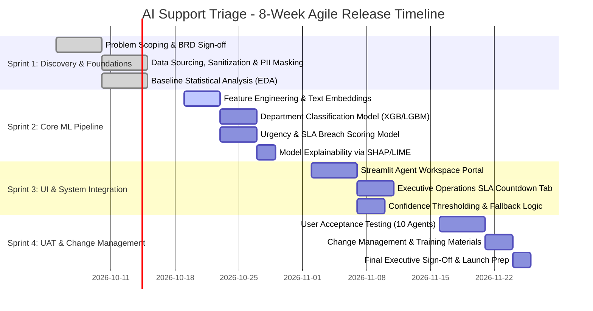

# Agile Sprint Roadmap & Execution Plan

| Project | Methodology | Sprint Cadence | Planned Velocity | Sprints Total |
| :--- | :--- | :--- | :--- | :--- |
| **AI Support Triage Engine** | Scrum (Agile) | 2 Weeks per Sprint | 28 Story Points / Sprint | 4 Sprints (8 Weeks) |

---

## 1. Scrum Governance & Operating Principles

### 1.1 Definition of Ready (DoR)
A User Story is deemed **Ready for Sprint Backlog** if:
1. Business value and user persona are explicitly stated (`As a... I want to... So that...`).
2. Gherkin-formatted Acceptance Criteria (`Given-When-Then`) are fully defined.
3. Data dependencies (schemas, sample records) are validated and available.
4. Story size is estimated by the team and does not exceed 8 story points.

### 1.2 Definition of Done (DoD)
A User Story is deemed **Done** only when:
1. Code adheres to clean coding standards (PEP 8 for Python, modularized functions, unit test coverage $>80\%$).
2. Machine learning models achieve specified performance criteria (Macro F1 $\ge 0.85$, latency $< 2.0$s).
3. Documentation is updated (Markdown docs, docstrings, schema changelogs).
4. Peer review approved via pull request.
5. Successfully verified and demoed during Sprint Review.

---

## 2. Sprint-by-Sprint Roadmap

---

## 3. Detailed Sprint Breakdown

### Sprint 1: Discovery, Data Governance & Exploratory Analysis
* **Focus:** Align stakeholders, formalize data dictionary, identify baseline bottlenecks.
* **Committed Points:** 26 Points

| Story ID | Epic | User Story Description | Story Points | Priority |
| :--- | :--- | :--- | :---: | :---: |
| **US-101** | Governance | *As a Compliance Officer*, I want all incoming customer text stripped of PII (credit cards, emails, phone numbers) so that GDPR/HIPAA standards are preserved. | 5 | P0 (Must Have) |
| **US-102** | Business Analysis | *As a Business Analyst*, I want to calculate baseline triage metrics (AHT, manual error rate, SLA penalties) so we can benchmark future ROI. | 5 | P0 (Must Have) |
| **US-103** | Data Engineering | *As a Data Scientist*, I want an automated ingestion pipeline that cleans, normalizes, and tokenizes raw support transcripts. | 8 | P0 (Must Have) |
| **US-104** | Exploratory Data Analysis | *As an ML Engineer*, I want an end-to-end Jupyter Notebook analyzing class imbalances, ticket length distributions, and top recurring keywords. | 8 | P1 (Should Have) |

---

### Sprint 2: Machine Learning Architecture & Explainability
* **Focus:** Build, tune, and validate the dual-prediction engine.
* **Committed Points:** 30 Points

| Story ID | Epic | User Story Description | Story Points | Priority |
| :--- | :--- | :--- | :---: | :---: |
| **US-201** | Modeling | *As an ML Engineer*, I want to train a multi-class department classifier achieving Macro-F1 $\ge 0.88$ on holdout test data. | 8 | P0 (Must Have) |
| **US-202** | Modeling | *As a Support Lead*, I want an SLA Breach Risk model that predicts tickets with $>70\%$ likelihood of exceeding standard resolution time. | 8 | P0 (Must Have) |
| **US-203** | Explainability | *As a Support Agent*, I want to see the key highlight words (SHAP values) that triggered the priority flag so I understand the model's reasoning. | 8 | P1 (Should Have) |
| **US-204** | Model Governance | *As a Lead BA*, I want a confusion matrix and classification report exported to evaluate false positives on critical tickets. | 6 | P1 (Should Have) |

---

### Sprint 3: Interactive Application & Human-In-The-Loop Workflow
* **Focus:** Prototype the decision cockpit and fallback safety nets.
* **Committed Points:** 28 Points

| Story ID | Epic | User Story Description | Story Points | Priority |
| :--- | :--- | :--- | :---: | :---: |
| **US-301** | UI / Agent | *As a Tier-2 Agent*, I want an interactive web portal displaying incoming tickets with predicted category, priority badge, and auto-drafted reply. | 8 | P0 (Must Have) |
| **US-302** | UI / Executive | *As a Support Director*, I want real-time operational KPI cards tracking live queue health, breach counters, and cumulative dollar savings. | 8 | P0 (Must Have) |
| **US-303** | Fallback System | *As an Operations Lead*, I want tickets with model confidence below 75% to automatically route into an "Ambiguity Review" queue. | 5 | P0 (Must Have) |
| **US-304** | Latency & Performance | *As an End User*, I want ticket classification and response generation to render in under 2 seconds. | 7 | P1 (Should Have) |

---

### Sprint 4: UAT, Change Management & Executive Launch
* **Focus:** User testing, agent feedback iterations, and final rollout readiness.
* **Committed Points:** 24 Points

| Story ID | Epic | User Story Description | Story Points | Priority |
| :--- | :--- | :--- | :---: | :---: |
| **US-401** | UAT | *As a Project Manager*, I want 10 front-line support staff to run 50 simulation tickets and log usability feedback. | 8 | P0 (Must Have) |
| **US-402** | Change Management | *As a Training Specialist*, I want a 1-page quick-reference guide and video walkthrough so agents adopt the new workflow smoothly. | 5 | P1 (Should Have) |
| **US-403** | Financial Auditing | *As a Financial Controller*, I want verified financial model scripts reflecting actual simulation time saved. | 5 | P1 (Should Have) |
| **US-404** | Project Closure | *As Project Lead*, I want a final Executive Presentation Deck summarizing KPIs, model performance, and phase-2 recommendations. | 6 | P0 (Must Have) |

---

## 4. Retrospective & Continuous Improvement Framework
At the conclusion of each sprint:
1. **What Went Well?** (e.g., Clean modular data pipelines, cross-functional collaboration)
2. **What Needed Improvement?** (e.g., Data imbalance on rare security tickets)
3. **Action Items:** Specific owners assigned to resolve blockers within 48 hours.
