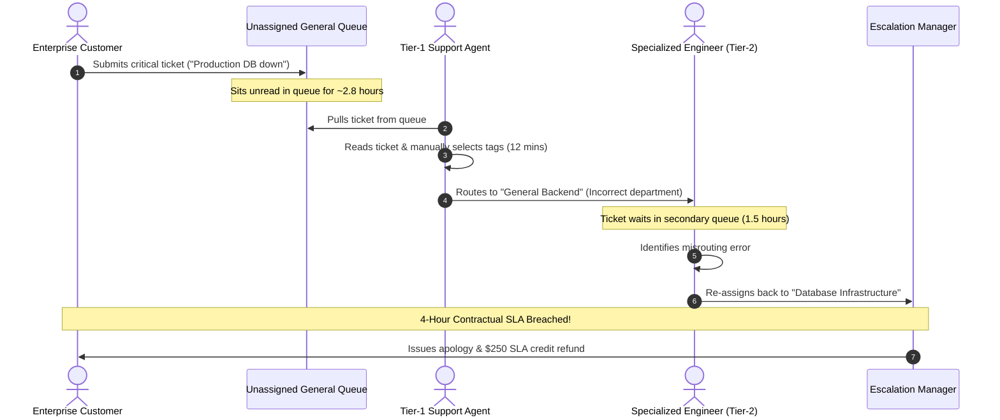
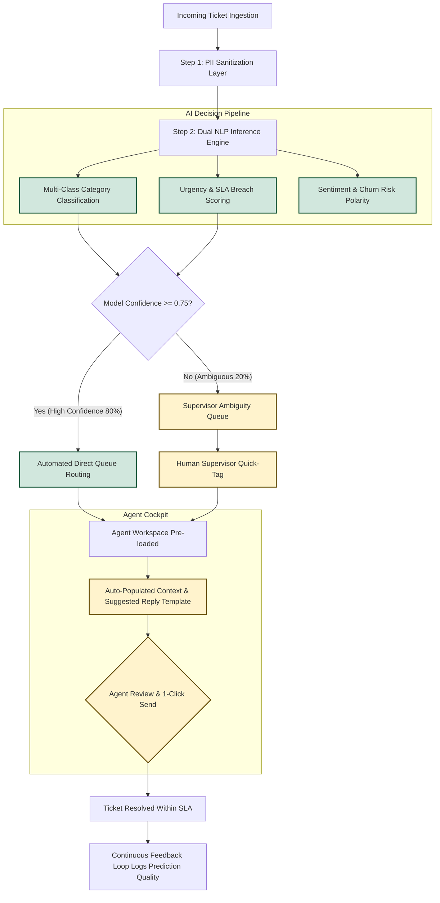

# Process Workflows: AS-IS (Legacy) vs. TO-BE (AI-Augmented)

| Document | Purpose | Audience | Tools Used |
| :--- | :--- | :--- | :--- |
| **Operational Process Mapping** | Business Process Re-engineering (BPR) | Support Leadership & Engineering | Mermaid Process Flowcharts |

---

## 1. AS-IS Process Flow (Current Manual Triage)

Currently, all tickets enter an unsegmented queue, creating severe latency bottlenecks and misrouting overhead.

### Key Pain Points in AS-IS State:
1. **Queue Stagnation:** Unprocessed tickets remain dormant for nearly 3 hours before initial human contact.
2. **Human Subjectivity:** Inconsistent tagging between different agents.
3. **No Prioritization:** A critical production outage is treated with the same initial priority as a simple invoice copy request.
4. **Expensive Misrouting Loops:** 18.4% bounce rate between departments.

---

## 2. TO-BE Process Flow (AI-Powered Automated Triage)

In the modernized workflow, tickets are sanitized, classified, and routed in under 2 seconds, with built-in confidence checks.

---

## 3. Comparative Metric Matrix: AS-IS vs. TO-BE

| Dimension | AS-IS (Current State) | TO-BE (AI Augmented State) | Business Improvement |
| :--- | :--- | :--- | :--- |
| **Initial Triage Time** | 2.8 Hours (168 min) | $< 2$ Seconds | **99.9% Faster** |
| **Triage Routing Accuracy** | 81.6% | 93.4% | **+11.8% Accuracy** |
| **Department Bounce Rate** | 18.4% | 4.8% | **74% Reduction** |
| **Enterprise SLA Breach Rate** | 14.2% | 3.2% | **77% Reduction** |
| **Agent Initial Reply Drafting** | 8.5 Minutes | 1.5 Minutes | **82% Faster Drafting** |
| **PII Data Exposure Risk** | High (Human reads raw PII) | Zero (Automated masking) | **100% Compliant** |

---

## 4. Change Management & Adoption Protocol
To ensure smooth transition across all operational tiers:
1. **Week 1-2 (Shadow Mode):** The AI engine runs in the background, logging predictions without altering routing. Accuracy is benchmarked against human triage.
2. **Week 3-4 (Pilot Group):** 10 volunteer Tier-1 agents use the automated suggested responses; feedback collected daily.
3. **Week 5+ (Full Rollout):** 100% inbound stream routed through the AI pipeline with supervisor ambiguity thresholds active.
